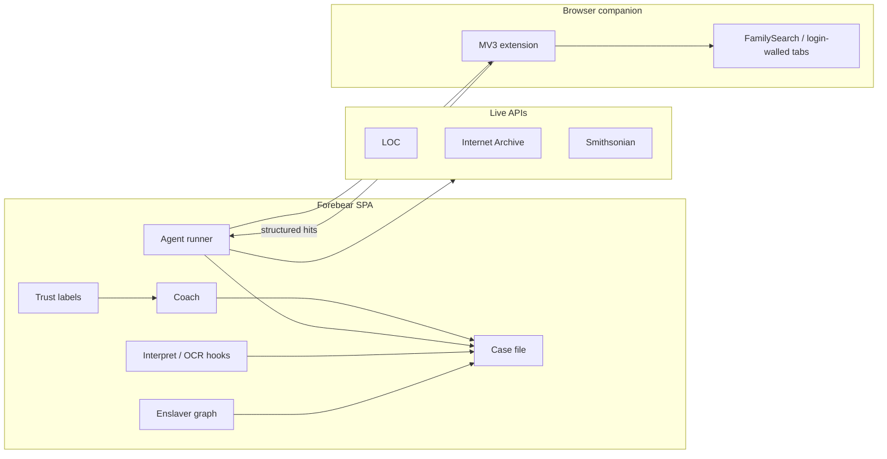
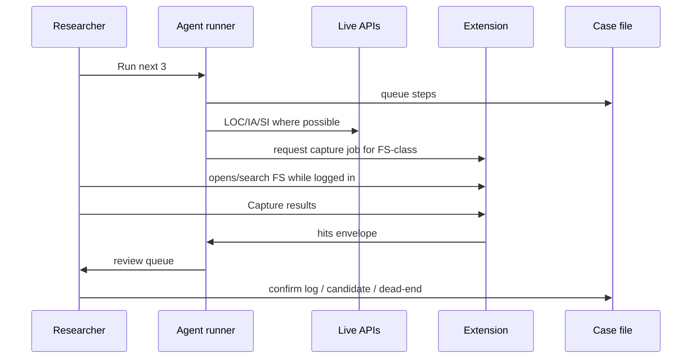

# feat: Discovery agent capability ladder

## Summary

Turn Forebear from a guided research companion into the goto **discovery agent for ancestors of the enslaved**: a closed-loop researcher that keeps a per-person case file, treats enslavers as first-class leads, runs (and assists) archive work—including login-walled sources via a user-driven browser companion—reads document content when available, imports existing trees, and never invents citations. Stay on the current HTML/CSS/JS + optional Vercel stack; rule-based method remains authoritative; LLM stays opt-in polish/explanation.

### Summary (scoping)

Full capability ladder with implementable units on every rung. Browser-assisted login-walled archives are an early dependency for closed-loop work, not a late add-on.

---

## Problem Frame

Family historians researching Black American and diaspora ancestors past the 1870 brick wall already have Ancestry, FamilySearch, and chatbots. Forebear’s wedge is method + honesty + agency: turn family memory into ranked archive leads, walk them until an enslaver–freedperson link is supported or honestly abandoned, and keep provenance visible. Today the app coaches and links well but does not hold a case file, model enslavers as graph objects, or close the suggest→search→read→log→next loop—especially on login-walled collections where most critical records live.

---

## Goal Capsule

Ship a sequenced ladder ending in an agent that can run (with human gates) emancipation-era discovery for a chosen ancestor, including assisted FamilySearch-class sources, while remaining local-first and citation-honest.

---

## Product Contract

### Actors

- **A1 Researcher** — primary user; confirms finds, candidates, and proof claims
- **A2 Family collaborator** — optional sync peer (existing family code); not a separate agent role in this ladder
- **A3 Browser companion** — user-installed extension/helper acting only on tabs the researcher opens while logged in

### Requirements

- **R1** Every brick-wall person has a **case file**: hypotheses, open questions, ranked candidates, place timeline, session coverage summary, and claim statuses (lead / hypothesis / confirmed / ruled-out)
- **R2** **Enslavers are first-class** entities reusable across people (surname, places, estates, notes, linked evidence)—not only `plan.candidates[]` strings
- **R3** Coach speaks from the case file; primary CTAs still map to real app actions
- **R4** Agent can **auto-queue** the next N checklist / registry items, open or assist searches, draft log/dead-end entries, and pause for confirmation
- **R5** **Browser companion** can, with explicit user gesture, extract search results or page metadata from login-walled sites the user has open and return structured hits to Forebear
- **R6** Where content is available (IA/LOC/transcripts/companion extracts), interpret **page text**, not only titles
- **R7** **GEDCOM import** seeds people/plans so the agent starts from existing trees
- **R8** Trust UX: every AI/agent sentence carries provenance class; shared surname never asserted as proof of enslavement
- **R9** DNA/Africa synthesis becomes agentic only after a solid U.S./Caribbean emancipation case file exists
- **R10** Core research remains usable with no OpenAI key and no extension; companion and LLM are opt-in

### Key Flows

- **F1** Open person → case file → coach next move → run/assist search → interpret → confirm log/candidate → case file updates
- **F2** Rank enslaver graph → test candidate across people → status promotion with evidence links
- **F3** “Run next 3” → live sources + companion-assisted FS-class sources → review queue → resolve
- **F4** Import GEDCOM → map to people → attach empty case files → coach from imported facts
- **F5** Bridge synthesis only when readiness gate + case file support it

### Acceptance Examples

- **AE1** For a person with birthplace + 1870 step done and no candidates, coach proposes earliest-mentions or checklist open; after “Run next 3,” three collections move to opened/queued without inventing citations
- **AE2** Same enslaver surname linked to two siblings shares one enslaver entity; ruling it out on one updates ranking for the other
- **AE3** With extension installed and FS tab open, user clicks “Capture results”; hits appear in insight panel with source=companion and require confirm before logging
- **AE4** GEDCOM with 5 individuals creates people + empty plans; coach runs without crash
- **AE5** AI enhance on coach changes wording only; `primary.kind` unchanged

### Scope Boundaries

**In scope:** schema/case file UI, enslaver graph, closed-loop runner, Chrome-class companion for login-walled assist, content interpretation hooks, GEDCOM import, trust labeling, DNA/Africa agent upgrades on existing `africa.js` surfaces.

**Deferred to follow-up:** full Ancestry proprietary APIs, unattended botting without user session, multi-user accounts/auth beyond family sync, mobile native apps, paid archive partnerships.

**Outside product identity:** general-purpose genealogy chatbot; claiming African ethnic certainty from DNA alone; rewriting to React/Next as a prerequisite.

### Success Criteria

- Brick-wall people can show a **tested** enslaver hypothesis with either supporting evidence or a documented dead-end trail within a guided multi-step run
- Login-walled assist works for at least one FamilySearch-class search path end-to-end with human confirm
- `npm test` green; new smoke coverage for case file migrate, enslaver graph, runner queue, GEDCOM import; companion has a minimal fixture test or documented manual checklist

---

## Planning Contract

### Assumptions

- Stay on global-script SPA architecture; new modules follow `js/*.js` + `app.html` load order; schema bumps via `migrate()` in `js/app.js`
- Browser assist is a **Chrome MV3 extension** (or equivalent) in-repo under `extension/`, talking to the open Forebear tab via `postMessage` / optional native messaging later—not headless cloud scraping of FS
- Companion never stores the user’s FS password; it only reads DOM the user already authenticated
- LLM continues through `api/llm.js` with client-supplied key; planner/runner uses rules first, LLM optional for ranking narratives
- NARA Catalog v2 remains deep-link until a live API returns; companion may still help on NARA web UI

### Key Technical Decisions

1. **Case file storage** — Extend `STATE.plans[personId]` (or sibling `STATE.cases[personId]` keyed the same) rather than a parallel store; migrate candidates into enslaver IDs over time. Prefer one `ensureCase(personId)` facade used by coach/runner.
2. **Enslaver entities** — New `STATE.enslavers{}` with stable ids; plan candidates become `{ enslaverId, status, note }`; keep surname string denormalized for search prefill.
3. **Agent runner** — Pure JS queue in `js/agent.js`: builds steps from `SOURCE_REGISTRY` + plan checklist + coach kinds; executes live fetchers where they exist; enqueues companion jobs for `needsLogin` sources; never auto-confirms “found.”
4. **Companion protocol** — Versioned message schema `{ type, personId, sourceId, payload }`; Forebear origin allowlist; user must click Capture / Allow per batch.
5. **Trust classes** — Enum on claims and UI chips: `lead | hypothesis | confirmed | ruled_out`; LLM outputs cannot create `confirmed`.
6. **Tests** — Expand `test/smoke.js` to load new core modules (coach through agent); companion tested with fixture HTML parsers in Node where possible.

### Alternatives Considered

| Approach | Why not |
|----------|---------|
| Cloud browser automation (Playwright on server) with user cookies | High ToS/security risk; breaks local-first trust |
| Rewrite in React before agent features | Delays the wedge; current stack can carry the ladder |
| LLM-as-planner choosing archive moves | Too easy to invent steps/citations; rules+registry stay planner |

### Product Contract preservation

Product Contract created in this bootstrap from the capability ladder conversation (1C full units, 2B browser-assist early). No separate brainstorm file.

---

## High-Level Technical Design

---

## Phased Delivery

| Phase | Rung | Outcome |
|-------|------|---------|
| **A** | Case file | Per-person research case + coach from it |
| **B** | Enslaver graph | First-class enslavers + ranking across tree |
| **C** | Browser companion (early) | MV3 capture protocol + one FS-class path |
| **D** | Closed-loop Discovery | Run-next-N + review queue across live + companion |
| **E** | Document reading | Content-level interpret on IA/LOC/companion text |
| **F** | GEDCOM import | Start from existing trees |
| **G** | Trust layer productization | Provenance UX everywhere agent speaks |
| **H** | DNA/Africa agent | Match import + synthesis driven by case readiness |

Phases A→B→C before D (closed-loop depends on companion). G can land incrementally earlier as chips, but units below keep a dedicated trust pass. H last.

---

## Implementation Units

### U1. Case file schema and migrate

**Goal:** Persist hypotheses, open questions, claim statuses, and coverage rollups per person.  
**Requirements:** R1  
**Dependencies:** none  
**Files:** `js/app.js`, `js/plan.js`, `test/smoke.js`  
**Approach:** Bump `SCHEMA_VERSION` (v5→v6). Add `emptyCase()` / `ensureCase(personId)` (either nested under plan or `STATE.cases`). Seed from existing plan step state + sessions. Migrate old plans without data loss.  
**Patterns to follow:** `emptyPlan`, `ensurePlan`, `migrate` comments in `js/app.js`.  
**Test scenarios:**
- Happy: v5 payload migrates; `ensureCase` returns stable shape
- Edge: person with no plan gets empty case on first ensure
- Integration: `mergeStates` / backup export includes cases

---

### U2. Case file UI surface

**Goal:** Readable case panel on Plan (and deep-link from Tree coach).  
**Requirements:** R1, F1  
**Dependencies:** U1  
**Files:** `js/plan.js`, `app.html`, `css/styles.css`, `js/coach.js`  
**Approach:** One composition: known facts, open questions, hypotheses list, coverage strip. Edit open questions; add hypothesis as lead. No dashboard clutter.  
**Test scenarios:**
- Happy: selecting plan person renders case fields from STATE
- Edge: empty case shows starter prompts from Field Guide step

---

### U3. Coach reads case file

**Goal:** `coachForPerson` prioritizes case hypotheses and coverage gaps over generic step copy.  
**Requirements:** R3, R8, AE5  
**Dependencies:** U1, U2  
**Files:** `js/coach.js`, `test/smoke.js` (load coach)  
**Approach:** Keep `primary.kind` vocabulary; change selection rules to consult case + sessions. LLM enhance still polishes headline/why only.  
**Execution note:** Add characterization assertions for a few fixture people before changing ranking rules.  
**Test scenarios:**
- Happy: opened-unresolved session → coach kind opens Discovery resume
- Happy: hypothesis without evidence → coach proposes test-candidate / earliest
- Edge: empty tree → story intake secondary unchanged

---

### U4. Enslaver entity store

**Goal:** `STATE.enslavers` with CRUD and plan candidate references by id.  
**Requirements:** R2, AE2  
**Dependencies:** U1  
**Files:** `js/app.js`, `js/plan.js`, `js/interpret.js`, `test/smoke.js`  
**Approach:** Create enslaver from surname+place; migrate string candidates to entities (dedupe by normalized name+state). Update `addEnslaverCandidate` / rank helpers.  
**Test scenarios:**
- Happy: add candidate creates enslaver + plan link
- Happy: two people link same enslaver id
- Edge: migrate duplicate surnames merge or keep separate with note—document choice in migrate

---

### U5. Enslaver graph UI + cross-person ranking

**Goal:** View/edit enslaver; see linked people and evidence; rank across tree.  
**Requirements:** R2, F2  
**Dependencies:** U4  
**Files:** `js/interpret.js`, `js/plan.js`, `css/styles.css`, `app.html`  
**Approach:** Panel on Plan step 4; show shared hits from sessions/logs. Ranking features: co-occurrence in county, newspaper era, sibling reuse.  
**Test scenarios:**
- Happy: rank order prefers candidate with session “found” support
- Edge: ruled-out enslaver deprioritized for siblings

---

### U6. Browser companion scaffold (MV3)

**Goal:** In-repo extension that pings Forebear and supports a dry-run “ping/pong” handshake.  
**Requirements:** R5, R10  
**Dependencies:** none (can parallel A/B; required before U8–U9)  
**Files:** `extension/manifest.json`, `extension/background.js`, `extension/content.js`, `extension/README.md`, `js/companion.js`, `app.html`  
**Approach:** MV3; host permissions limited to documented genealogy domains + Forebear origins; Forebear shows companion status (detected / not). No scraping yet.  
**Test scenarios:**
- Happy: Forebear shows “Companion connected” after ping
- Error: missing extension → clear install CTA, app otherwise fine
- Test expectation: Node unit for message schema validation; manual checklist in extension README

---

### U7. Companion capture for one FamilySearch-class path

**Goal:** User-initiated capture of search result rows from one supported FS (or FS-like) results page into Forebear hit shape.  
**Requirements:** R5, AE3  
**Dependencies:** U6, U1  
**Files:** `extension/content.js`, `extension/parsers/familysearch.js`, `js/companion.js`, `js/interpret.js`  
**Approach:** Parser isolates to one URL pattern; map to `{ label, url, year?, note, source:'companion' }`. User clicks Capture; review before STATE mutation.  
**Test scenarios:**
- Happy: fixture HTML → parsed hits array
- Edge: unexpected DOM → empty hits + toast, no throw
- Integration: hits feed `refreshHitInsightPanel`

---

### U8. Agent runner + review queue

**Goal:** “Run next N” builds a queue from checklist/coach, executes live searches, enqueues companion jobs, presents review cards.  
**Requirements:** R4, F3, AE1  
**Dependencies:** U3, U6, U7 (companion path), live Discovery APIs in `js/app.js`  
**Files:** `js/agent.js`, `js/app.js`, `js/plan.js`, `app.html`, `css/styles.css`, `test/smoke.js`  
**Approach:** Steps typed `live | link | companion`. Live reuses existing LOC/IA/SI search functions. Link steps open registry URL and mark opened. Companion steps wait for capture. Review actions: Found (draft log), Nothing (dead-end), Skip, Add enslaver lead.  
**Test scenarios:**
- Happy: queue of 3 with mock live results marks session checks
- Happy: companion step stays pending until capture message
- Edge: no person selected → toast, no queue
- Error: live fetch fail → step error state, continue others

---

### U9. Closed-loop session + case updates

**Goal:** Resolving review cards updates sessions, case hypotheses, and enslaver links automatically enough that coach advances.  
**Requirements:** R1, R4, F1  
**Dependencies:** U8, U4  
**Files:** `js/agent.js`, `js/coach.js`, `js/app.js`  
**Approach:** Wire resolve handlers to existing `resolveSource` / `draftLogPrefill` / `addEnslaverCandidate`. Append case timeline events.  
**Test scenarios:**
- Happy: dead-end resolve increments coverage and removes from opened-unresolved badge logic
- Happy: found + enslaver surname → candidate/entity linked as lead not confirmed

---

### U10. Document text hooks (IA/LOC)

**Goal:** When preview/transcript text exists, interpret uses excerpt for why/lenses.  
**Requirements:** R6  
**Dependencies:** U8 helpful but not required; needs interpret  
**Files:** `js/interpret.js`, `js/app.js` (preview paths), `test/smoke.js`  
**Approach:** Pass optional `excerpt` into `interpretHit`; enslaver-lead lens looks for “belonging to”, “servant”, enslaver surname tokens. No claim of OCR accuracy—label as excerpt-based.  
**Test scenarios:**
- Happy: excerpt containing enslaver surname raises enslaver-lead confidence vs title-only
- Edge: empty excerpt → prior title behavior

---

### U11. Companion / upload transcript path

**Goal:** Accept pasted or companion-provided plain text for a hit and re-run interpret.  
**Requirements:** R6, R5  
**Dependencies:** U7, U10  
**Files:** `js/interpret.js`, `js/companion.js`, `app.html`  
**Approach:** “Add page text” on insight card; store on session check metadata; do not invent citations beyond URL user provided.  
**Test scenarios:**
- Happy: paste text updates insight why
- Edge: very long text truncated with notice

---

### U12. GEDCOM import

**Goal:** Import GEDCOM 5.5.x into people (+ basic parent links); create empty plans/cases.  
**Requirements:** R7, AE4, F4  
**Dependencies:** U1  
**Files:** `js/gedcom.js` (new) or extend export path in `js/app.js`, `app.html`, `test/smoke.js`  
**Approach:** Mirror existing GEDCOM export structures; import subset (INDI, FAM, NAME, BIRT, DEAT, PLAC). Conflict policy: new ids, optional merge by name+year later (defer smart merge).  
**Test scenarios:**
- Happy: sample GEDCOM → N people, parentIds set
- Edge: malformed line → skip with warning count
- Integration: coachForPerson works on imported person

---

### U13. Trust labels productization

**Goal:** Consistent provenance chips on coach, insight, synth, agent review, enslaver statuses.  
**Requirements:** R8, AE5  
**Dependencies:** U3, U8, U5  
**Files:** `js/coach.js`, `js/interpret.js`, `js/synthesize.js`, `js/agent.js`, `js/llm.js`, `css/styles.css`  
**Approach:** Shared `trustBadge(class)`; LLM system prompt already forbids invented citations—enforce that enhance cannot upgrade to confirmed.  
**Test scenarios:**
- Happy: agent review cards show lead/hypothesis badges
- Edge: enhance coach leaves kind + trust class stable

---

### U14. DNA match import + case-gated Africa agent

**Goal:** Import a simple match CSV/list into `person.dna`; synthesizeBridge proposes next DNA questions and ethnonym only when emancipation case readiness + trust rules pass.  
**Requirements:** R9, F5  
**Dependencies:** U1, U13, existing `js/synthesize.js` / `js/africa.js`  
**Files:** `js/africa.js`, `js/synthesize.js`, `app.html`, `test/smoke.js`  
**Approach:** Minimal CSV columns (name, company, ethnicity notes); runner action “review DNA workspace”; never auto-set regionConfidence to confirmed.  
**Test scenarios:**
- Happy: CSV import fills keyMatches
- Happy: synth readiness false → coach blocks Africa leap
- Edge: empty CSV → toast

---

### U15. Smoke harness + docs for agent stack

**Goal:** Load coach/story/interpret/synthesize/agent/companion stubs in `test/smoke.js`; document companion install + ladder status in README.  
**Requirements:** success criteria / R10  
**Dependencies:** U8, U12 (partial OK earlier)  
**Files:** `test/smoke.js`, `README.md`, `extension/README.md`  
**Approach:** Eval order matches `app.html`; stub `postMessage`.  
**Test scenarios:**
- Happy: `npm test` covers migrate v6, enslaver link, agent queue mock, gedcom import fixture
- Test expectation: companion DOM parse fixtures run in Node

---

## Verification Contract

- `npm test` passes with expanded smoke coverage above
- Manual: companion install → ping → FS fixture/capture → review queue confirm
- Manual: GEDCOM import → coach → Run next 3 on live sources without key
- Manual: AI enhance still optional and kind-stable
- No server stores OpenAI or FS credentials

## Definition of Done

All phases A–H have landed their units (U1–U15) or an explicit issue tracks any slipped unit; AE1–AE5 demonstrable on a sample or imported tree; README documents companion + agent runner; trust language reviewed for “surname ≠ enslavement.”

---

## Risks & Dependencies

| Risk | Mitigation |
|------|------------|
| FS DOM changes break parser | Isolate parser; fixture tests; version pin + “unsupported page” toast |
| Extension store / ToS | Sideload-first; document user-driven capture only; no credential handling |
| Scope explosion (1C) | Ship by phase tags; do not block A/B on companion polish |
| Schema merge conflicts with sync | Include enslavers/cases in `mergeStates` with updatedAt rules |
| Over-trust in AI | Trust chips + no auto-confirmed; rule planner owns moves |

**Dependencies:** Chrome (or Chromium) for companion; Vercel (or `vercel dev`) for `/api/llm` only; existing LOC/IA/SI CORS behavior.

---

## Open Questions

- **Deferred:** Exact second login-walled site after FamilySearch (Ancestry vs NARA UI vs state archive)—choose after U7 learnings  
- **Deferred:** Smart GEDCOM merge vs always-create-new  
- **Deferred:** Whether companion ever uses native messaging vs only extension↔tab  

None blocking for starting U1.

---

## System-Wide Impact

- **Sync payload size** grows with enslavers/cases/agent events—watch Upstash limits  
- **Privacy:** companion host permissions are a trust moment; keep list minimal and documented  
- **Onboarding:** sample Freemans family should gain a demo case file + one enslaver entity  

---

## Documentation Plan

- Root `README.md`: agent runner + companion  
- `extension/README.md`: install, permissions, capture flow  
- Field Guide blurb: case file + enslaver graph concepts (short)

---

## Sources & Research

- Prior product framing: capability ladder conversation (case file → graph → closed loop → OCR → GEDCOM → trust → DNA/Africa)  
- Codebase seams: `js/app.js` STATE/migrate, `js/plan.js`, `js/coach.js`, `js/interpret.js`, `js/sources.js`, `js/africa.js`, `api/llm.js`  
- External: Chrome MV3 extension model; FamilySearch ToS imply user-session assist only (no credential proxy)

---

## Future Considerations

- Additional companion parsers  
- Evidence graph / contradiction engine across logs  
- Optional cloud agent runs for multi-device queues (only if local-first preserved)
